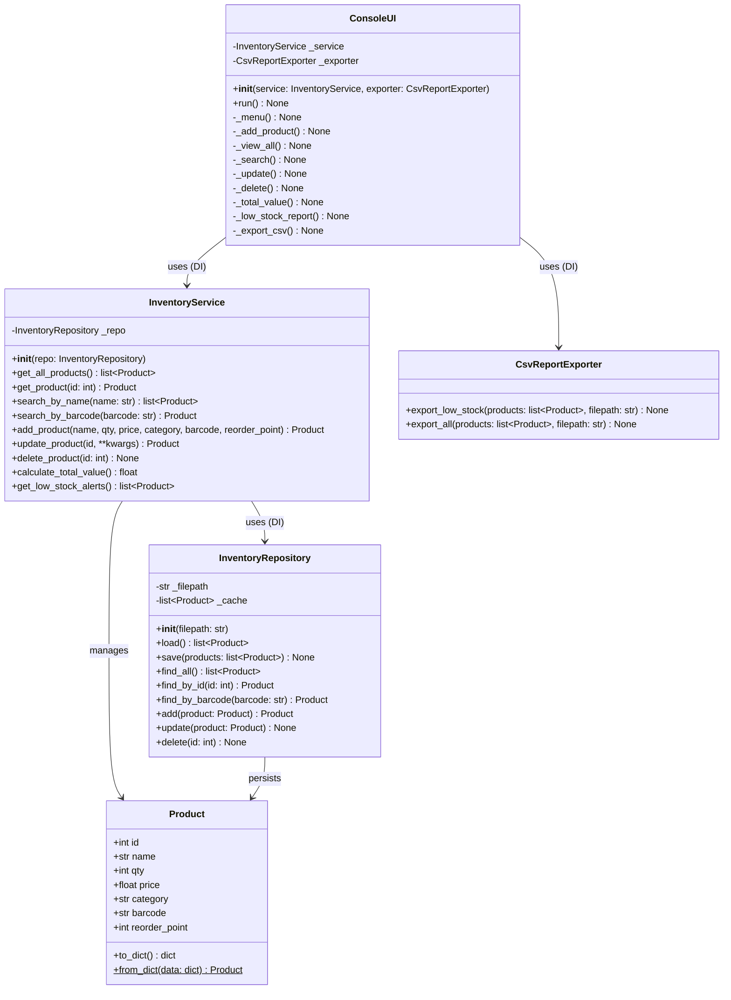

# To-Be Architecture — Class Diagram (Mermaid)
## Inventory Management System v2.0



---

## Design Patterns Applied

| Pattern | Where Used | Reason |
|---------|-----------|--------|
| **Repository** | `InventoryRepository` | Decouples persistence (JSON) from business logic; swap to DB without changing service |
| **Dependency Injection** | `InventoryService.__init__(repo)` | Eliminates `global x`; makes unit-testing with mock repos trivial |
| **Factory Method** | `Product.from_dict()` | Centralises object construction from raw data |
| **Facade** | `InventoryService` | Single entry point for all business operations; hides repository complexity from UI |

---

## ISO 25010 Quality Evaluation

| Characteristic | v1 (Baseline) | v2 (Target) | Improvement |
|---------------|--------------|------------|-------------|
| **Maintainability** | ❌ Global state, no classes | ✅ Repository + DI | Major |
| **Testability** | ❌ `input()` in logic | ✅ Pure functions, DI | Major |
| **Reliability** | ❌ No error handling | ✅ Exception handling | Major |
| **Security** | ❌ Raw `input()` → crashes | ✅ Validated inputs | Moderate |
| **Portability** | ❌ In-memory only | ✅ JSON persistence | Moderate |
| **Functional Suitability** | ⚠️ Basic CRUD | ✅ + Barcode, Reorder, CSV | High |

---

## Architecture Layers

```
┌─────────────────────────────────────┐
│          ConsoleUI (UI Layer)        │  ← user interaction only
├─────────────────────────────────────┤
│      InventoryService (Logic Layer)  │  ← pure business rules
├─────────────────────────────────────┤
│  InventoryRepository (Data Layer)   │  ← JSON read/write
├─────────────────────────────────────┤
│        Product (Model Layer)        │  ← data structure
└─────────────────────────────────────┘
```
